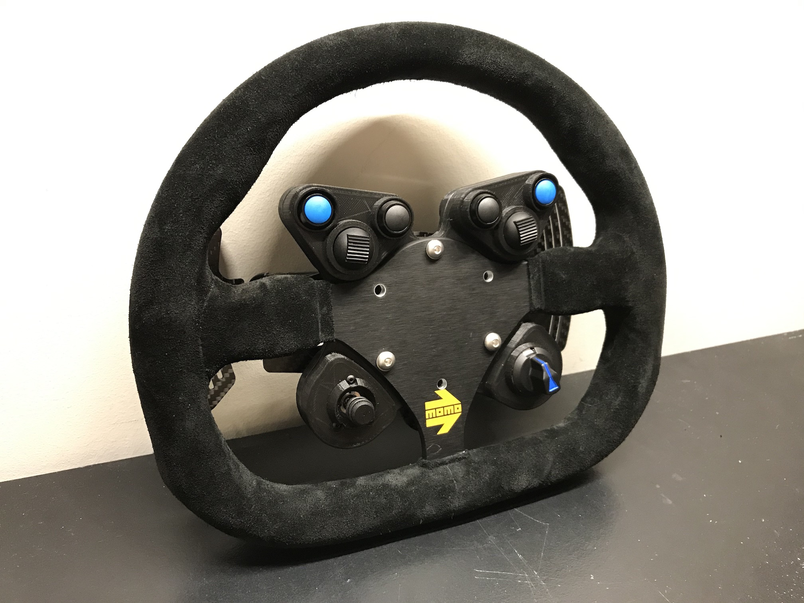
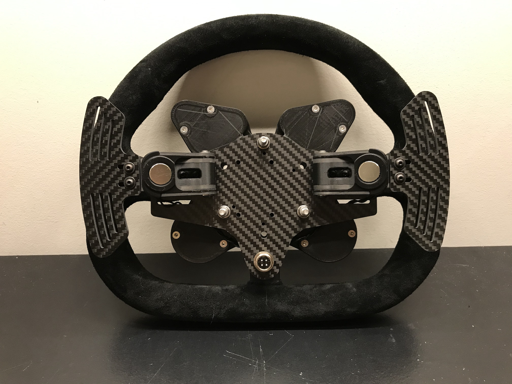
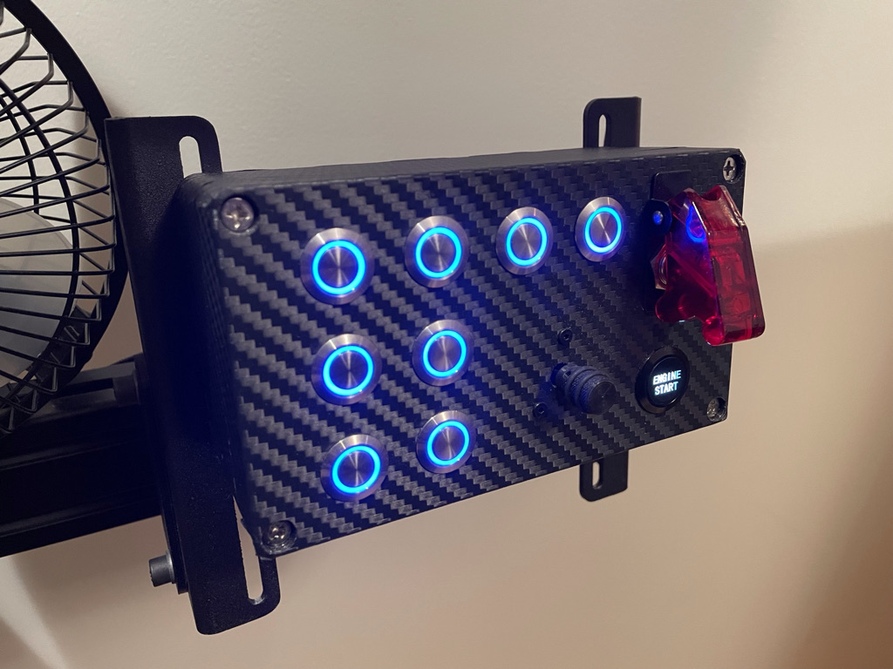

# SimRacingProjects

This repository is a collection of personal projects related to sim racing that I either want version controlled or just want to share.

## GT Wheel
Home built GT style racing wheel with 8 momentary buttons, two paddle shifter inputs, one encoder, and one funky switch, all running through a Sparkfun Pro Micro, in a custom made 3D printed enclosure, and mounted on a MOMO Mod 27 290mm wheel.

Check out the [gt_wheel](https://github.com/stevendaniluk/SimRacingProjects/tree/master/gt_wheel) directory for more details.

## Button Box
Home built button box with 8 auxillary momentary buttons, one starter button, one ignition switch, and one funky switch, all running through a Sparkfun Pro Micro, in a project box wrapped in totally real carbon fiber.

Check out the [button_box](https://github.com/stevendaniluk/SimRacingProjects/tree/master/button_box) directory for more details.

