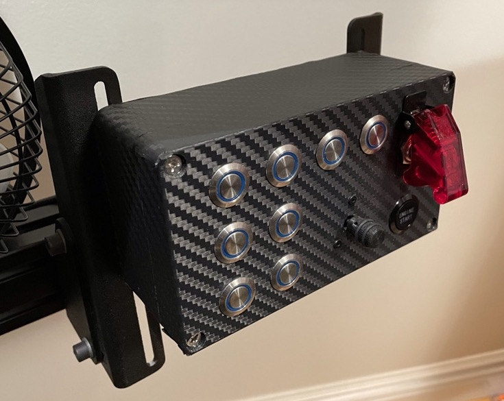
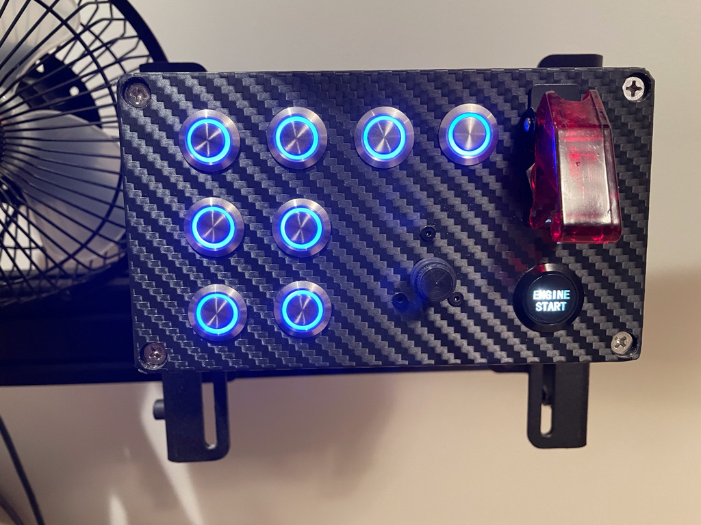
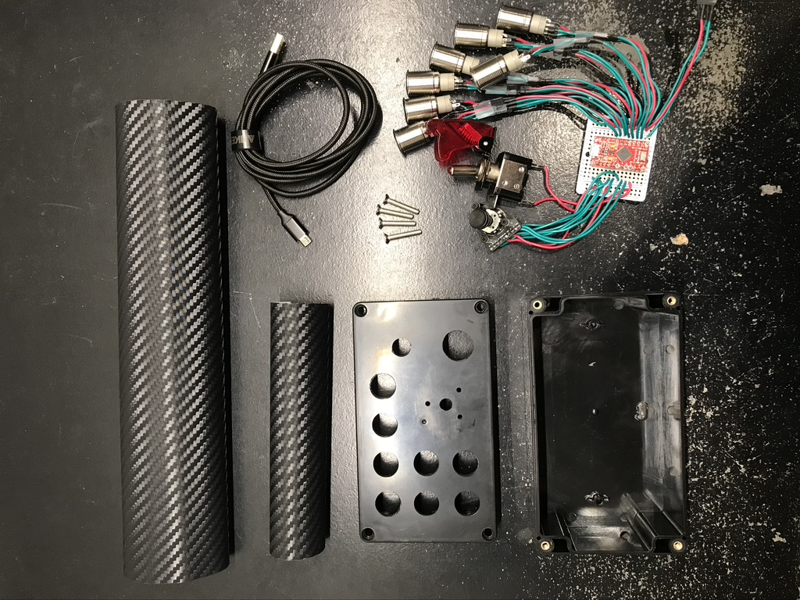
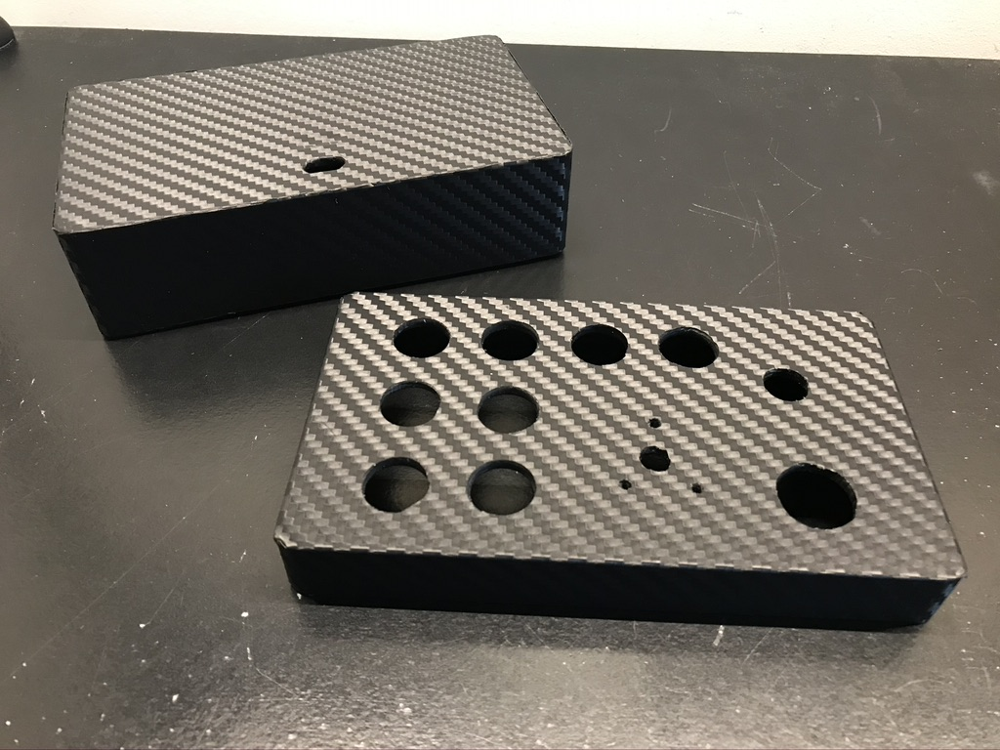

# Button Box
This is a custom made button box with 8x momentary auxillary buttons, starter button, ignition switch, and a funky switch.

  
  

## BOM

| Quantity | Part | Manufacturer |
| :-: | :-- | :-: |
| 1 | [Black ABS Project Case (158x90x60 mm)](https://www.amazon.com/dp/B07W6SJGJM?ref=ppx_pop_mob_ap_share&th=1) | LeMotech |
| 1 | Carbon Fiber Vinyl Wrap | 3M |
| 1 | [6ft Braided Micro USB to USB A Cable](https://www.amazon.com/Anker-Braided-Tangle-Free-Gold-Plated-Connectors/dp/B07DC2HC8Q/ref=sr_1_4?dchild=1&keywords=usb%2Bmicro%2B6ft%2Bbraided&qid=1589749775&sr=8-4) | Anker |
| 1 | [SparkFun Pro Micro - 5V](https://www.sparkfun.com/products/12640) | SparkFun |
| 1 | [2" Proto Board](https://www.sparkfun.com/products/8811) | SparkFun |
| 1 | [Toggle Switch and Cover](https://www.sparkfun.com/products/11310) | SparkFun |
| 1 | [Engine Start Button](https://www.amazon.com/Keenso-Ignition-Starter-Mounting-Zinc-Aluminium/dp/B07DNSL7Z5/ref=sr_1_29?dchild=1&keywords=aluminum%2Bpush%2Bbutton&qid=1589744316&sr=8-29&th=1) | Keenso |
| 8 | [Illuminated Metal Push Button](https://www.sparkfun.com/products/11967) | SparkFunn |
| 1 | [Funky Switch](https://www.apexsimracing.com/collections/encoders/products/funky-switch) | Apex Sim Racing |

## Build
All buttons and switches were wired up to a proto board with Dupont connectors in between. The enclosure is a simple plastic project box that has been wrapped in 3M carbon fiber vinyl to make it look extra fancy.

## Microcontroller Setup
The Arduino script for the microcontroller is included under the `button_box` directory, it requries the [SimRacingInputs](https://github.com/stevendaniluk/SimRacingInputs/) library.

If you are connecting multiple microcontrollers of the same type to one Windows machine see the [Multiple Microcontrollers](https://github.com/stevendaniluk/SimRacingInputs#multiple-microcontrollers) section on the [SimRacingInputs](https://github.com/stevendaniluk/SimRacingInputs/) page for tips to make this work.
