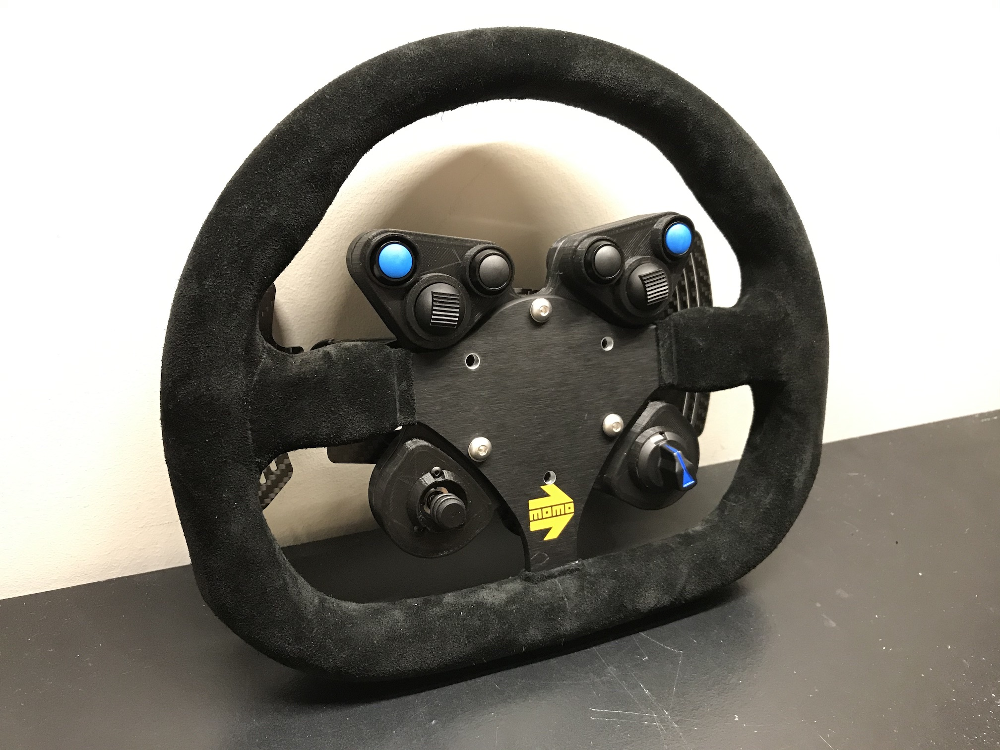
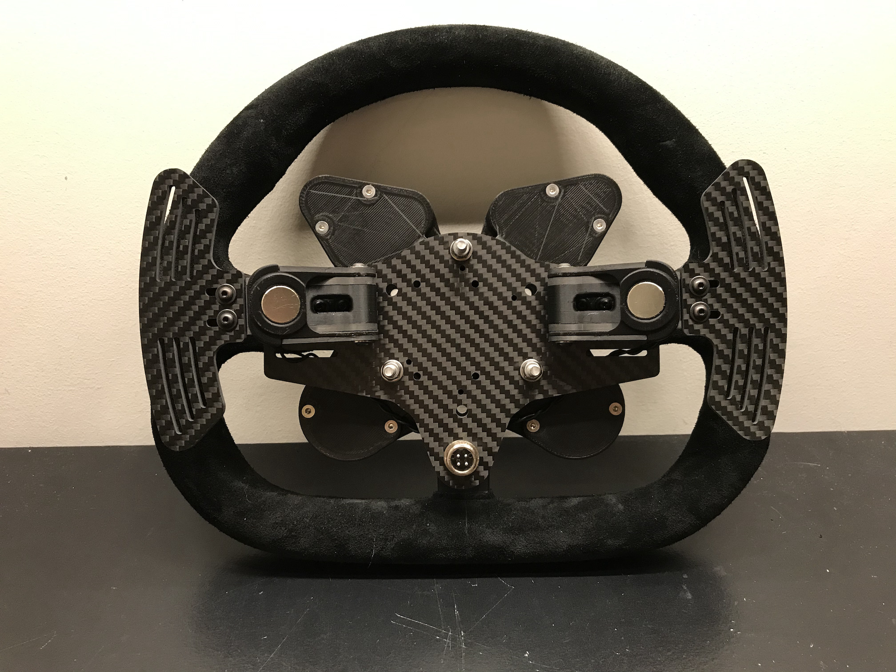
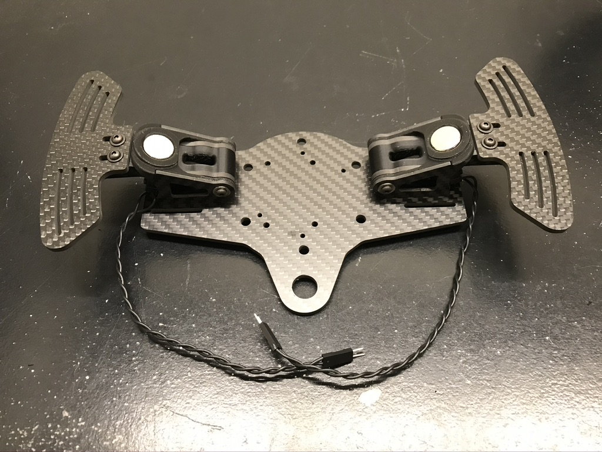
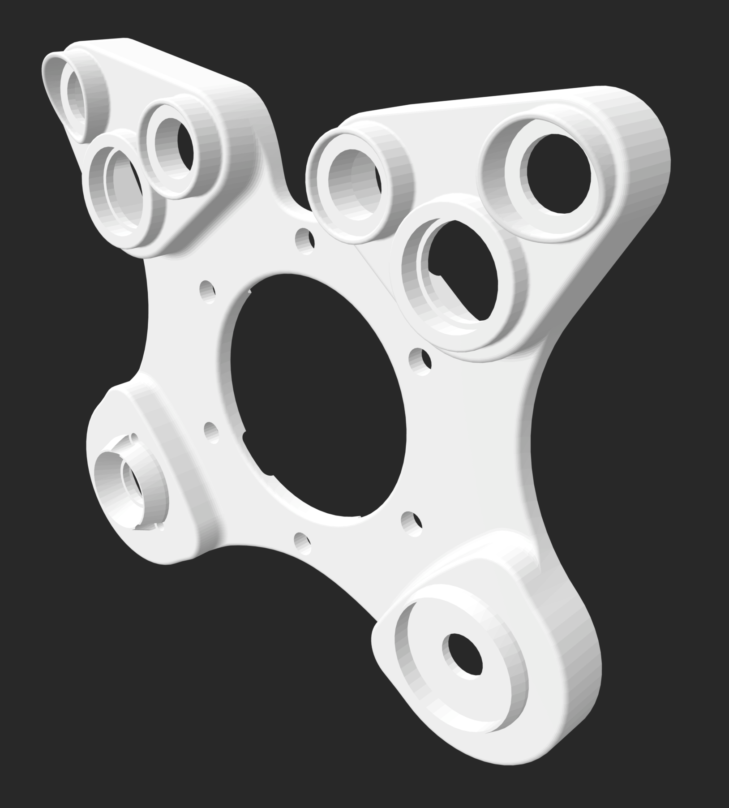

# GT Wheel
This is a custom designed GT style sim racing wheel with paddle shifters, 4x momentary buttons, 2x momentary toggles, encoder, and a funky switch.

  
  
  

## BOM

| Quantity | Part | Manufacturer |
| :-: | :-- | :-: |
| 1 | [Mod 27 290mm wheel](https://momo.com/en-us/momo-racing-steering-wheels/momo-mod-27.html?pn=R1925/29S#) | MOMO |
| 1 | [Evo 5 paddle shifters - GT3 style](https://opensimracing.com/collections/paddles/products/osr-evo-5-roller-bearing-magnetic-shifters-ready-to-install?variant=7356260941854) | OSR |
| 1 | Shifter Mounting Plate | OSR |
| 1 | [SparkFun Pro Micro - 5V](https://www.sparkfun.com/products/12640) | SparkFun |
| 1 | [Coiled USB Cable with 4 Pin M12 Connectors](https://opensimracing.com/collections/electronic-hardware/products/electronics-12mm-aviation-socket?variant=31210585653325) | OSR |
| 2 | [Momentary  Button - Black](https://opensimracing.com/collections/electronic-hardware/products/electronics-momentary-button?variant=30737899969) | OSR |
| 2 | [Momentary  Button - Blue](https://opensimracing.com/collections/electronic-hardware/products/electronics-momentary-button?variant=30737900161) | OSR |
| 2 | Momentary Thumb Switch (Ferrari 488 Style) | OSR |
| 1 | [Rotary Encoder](https://opensimracing.com/collections/electronic-hardware/products/electronics-cts-rotary-encoder) | OSR |
| 1 | Encoder Knob (Mclaren Style) | OSR |
| 1 | [Funky Switch](https://www.apexsimracing.com/collections/encoders/products/funky-switch) | Apex Sim Racing |
| 1 | 3D Printed Enclosure | |

## Build
The build was pretty straightforward. All inputs were wired up with Dupont connectors so that all the plugs would come out the center of the enclosure where they would be plugged into the microcontroller. The microcontroller and plugs are sandwiched between the wheel and the shifter plate, it's a tight squeeze but it all fits.

The wheel has 19 inputs, but the Pro micro only has 18 pins available. So both shifter inputs are connected to the same analog pin, with each of them running through a resistor with different values so their voltage levels when pressed will be unique.

  
  
  
  
  

## Microcontroller Setup
The Arduino script for the microcontroller is included under the `gt_wheel` directory, it requries the [SimRacingInputs](https://github.com/stevendaniluk/SimRacingInputs/) library.

If you are connecting multiple microcontrollers of the same type to one Windows machine see the [Multiple Microcontrollers](https://github.com/stevendaniluk/SimRacingInputs#multiple-microcontrollers) section on the [SimRacingInputs](https://github.com/stevendaniluk/SimRacingInputs/) page for tips to make this work.

## Enclosure
The enclosure was designed to be easily printed on an FDM 3D printer with minimal support required, only on interior parts. Are bolt holes are sized for M3 screws, no tapping required. This was printed on an Ultimaker 2 with black PLA material.

  

